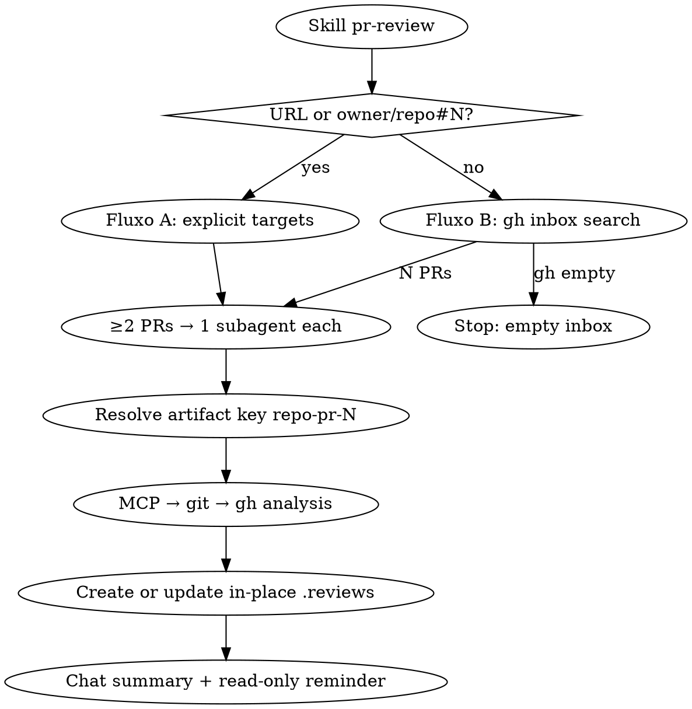
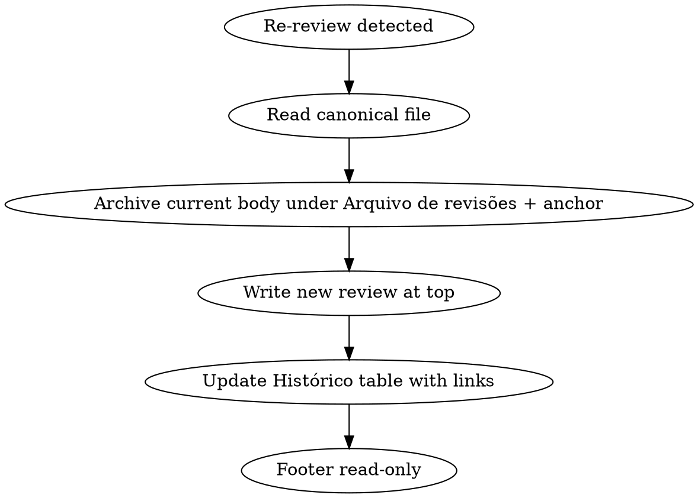

Follow [CLAUDE.md § 1.3 Git and GitHub](../../CLAUDE.md) and [CLAUDE.md § 1.4 PR review read-only](../../CLAUDE.md) — **read-only security lock** applies unless the user explicitly overrides travas.

# Pull Request review — `.reviews/` artifact

Skill **exclusive** to produce **structured markdown review** locally. The user reads the file and **manually** decides what to comment, approve, or reject on GitHub.

Two entry modes (route **before** analysis):

| Mode | When | Targets |
|------|------|---------|
| **Fluxo A** | Prompt contains ≥1 PR URL (`github.com/.../pull/N`) or `owner/repo#N` | Only those PRs |
| **Fluxo B** | Skill cited / “revisar PRs” **without** any PR target | All open PRs with `review-requested:@me` |



## Golden rule (non-negotiable)

| Allowed | Forbidden |
|---------|-----------|
| Create **or update in-place** `.reviews/*-<repo>-pr-<N>.md` (**one canonical file per PR**) | Approve, request changes, or comment on the PR on GitHub |
| Read PR via MCP / git / `gh` (read-only) | Merge, close, edit title/body/labels, add reviewers |
| **Preliminary verdict** inside the markdown for human decision | Treat preliminary verdict as permission to act on GitHub |
| **Texto para colar** por RC / Melhoria (copy-paste **inside the file only**) | Publish that text via MCP/`gh`/UI |
| Second pass on same PR → **rewrite the newest existing file** + archive prior body + Histórico with anchors | Create a second markdown for the same `<repo>-pr-<N>` |

**Common mistake:** concluding “PR looks good” and then **approving** on GitHub — **out of scope**. Stop after saving markdown and confirming GitHub was not touched.

**Override:** only if the user **explicitly** ignores travas or asks to publish on GitHub.

**Out of scope:** publish/approve/comment on GitHub; fix code / commits / push; `.issues/` proposals; epic specs (`especificacao-cards`).

**Workspace flow (per PR):**
```
PR target(s) → MCP GitHub (Toolbox)
            → if 404/422 permission: git on local clone (0.1)
            → if gap remains: gh CLI read (0.2)
            → resolve artifact (unique key) → create or update in-place
            → user reviews manually on GitHub
```

---

## Trigger

Activate when the user:
- Cites **skill `pr-review`**, or asks **revisar PR**, **review do PR**, **RCs do PR**, **pending reviews**, **inbox de review**
- Sends **PR URL**(s) or **`owner/repo#N`** (Fluxo A)
- Asks for PR diff analysis **without** publishing on GitHub
- Invokes the skill **with no PR target** (Fluxo B — inbox)

**Never** mix this skill's output with `.issues/` in the same turn, unless explicitly asked for both artifacts separately.

---

## Input

Normalize when useful. **PR is optional** (absence → Fluxo B).

```markdown
## Revisão solicitada
- **PR:** <optional — one or more URLs or owner/repo#number>
- **Repo local:** <optional — path or @folder; speeds fallback>
- **Foco:** <optional — analysis focus only; do not put in artifact header>
- **Base de comparação:** <optional>
- **Contexto extra:** <optional>
- **Instruções do revisor:** <optional>
```

| Condition | Action |
|-----------|--------|
| ≥1 PR target in prompt | **Fluxo A** — parse all targets; do **not** search inbox |
| No PR target | **Fluxo B** — `gh search prs --review-requested=@me --state=open` first; do **not** ask “qual PR?” |

---

## Fluxo A — explicit PR(s)

1. Extract every `owner`, `repo`, `pullNumber` from URLs / `owner/repo#N`.
2. If **one** PR → analyze in this agent (analysis steps 0–6 + artifact rules, incluindo §5 paridade HML→prod).
3. If **two or more** → orchestrator lists them, then launches **one subagent per PR in parallel** (same contract as Fluxo B workers).
4. Each PR: resolve artifact → analyze → create or update in-place → return path + verdict + counts to orchestrator.

---

## Fluxo B — inbox `review-requested:@me`

Equivalent to GitHub UI search: `is:pr is:open review-requested:@me`  
(UI paths like `/issues/SSC_…` are irrelevant.)

**Inbox listing is special:** for Fluxo B, **`gh` (local session) is canonical**. MCP Toolbox search often returns `total_count: 0` for `review-requested` on private AGX repos even when the browser/`gh` show results — **never** treat MCP-only zero as an empty inbox.

### B.1 List pending PRs

| Step | Tool | Detail |
|------|------|--------|
| 1 (**required**) | `gh` read-only | `gh search prs --review-requested=@me --state=open --json url,number,title,repository --limit 100` |
| 2 (only if `gh` missing / auth fail) | MCP `Toolbox` (tools `mcp__Toolbox__*`) → `github__search_pull_requests` | `query: "is:open review-requested:@me"` as last resort |

**Forbidden inbox commands** (known false empty):

- `gh search prs "is:open review-requested:@me"` — query-string form returns `[]` here; **always use flags** `--review-requested=@me --state=open`
- Declaring empty from MCP `total_count: 0` **without** having run the required `gh` command first

Deduplicate by `owner/repo#number`. Sort stable (e.g. updated desc) for chat listing. If `gh` succeeds with N>0, use that list even when MCP would return 0.

### B.2 Empty inbox

Declare empty **only if**:

1. `gh search prs --review-requested=@me --state=open …` returned an empty list, **or**
2. `gh` failed (not installed / not authenticated) **and** MCP search also returned 0 / failed

Then report that the review inbox is empty. **Do not** ask for a PR URL as a substitute for searching. **Do not** create `.reviews/`. Stop.

### B.3 Parallel review

1. Orchestrator lists N PRs in chat (repo, number, title, URL).
2. Launch **one subagent per PR** in parallel.
3. Each worker MUST follow this skill: analysis chain, **artifact uniqueness**, read-only lock; return `{ path, verdict, rcCount, melCount, qCount, topFindings }`.
4. Orchestrator consolidates a final table (path | verdict | counts) + mandatory GitHub reminder.

**Worker prompt must include:** full skill path or “follow skill pr-review”; exact `owner/repo#N`; workspace root for `.reviews/`; forbid GitHub writes; require artifact resolve before write.

---

## Unique artifact / update in-place (mandatory, A and B)

**Key:** `<repo-slug>-pr-<N>` (e.g. `core-pr-8441`). `repo-slug` = short repo name.

**Timestamps:**

| Use | Format | Example |
|-----|--------|---------|
| Filename prefix | `YYYY-MM-DD-HH-MM-SS` (local 24h) | `2026-07-22-12-33-02` |
| Data in artifact table | `DD/MM/YYYY às HH:MM:SS` | `22/07/2026 às 12:33:02` |
| Anchor id | `revisao-` + `YYYY-MM-DD-HHMMSS` (no colons) | `revisao-2026-07-22-123302` |

Use the **same** local instant for filename (on create), cabeçalho **Data**, Histórico row, and anchor id.

**Before every write:**

1. List matches: `.reviews/*-<repo-slug>-pr-<N>.md` (exact suffix before `.md`; ignore unrelated suffixes).
2. **0 matches** → create  
   `.reviews/<YYYY-MM-DD-HH-MM-SS>-<repo-slug>-pr-<N>.md`  
   (if same-second collision on create only, suffix `-v2`, `-v3`).
3. **≥1 match** → pick the **newest** by timestamp prefix in the filename (`YYYY-MM-DD-HH-MM-SS`); **rewrite that path only**.  
   **Forbidden:** creating another file with the same key.  
   **Do not** delete older duplicate files in the session.

### Update in-place shape (re-review)



1. **Current revision body** = everything from H1 until (but not including) `## Arquivo de revisões` / `## Histórico de revisões` / footer.
2. **Before overwriting:** move that body into `## Arquivo de revisões` (placed **before** Histórico), wrapped as:

```markdown
<a id="revisao-2026-07-22-123302"></a>

### Revisão de 22/07/2026 às 12:33:02 — `request_changes`

(conteúdo completo da revisão anterior)
```

   - Anchor id from the **previous** revision’s Data / filename instant (`revisao-YYYY-MM-DD-HHMMSS`).
   - Preserve existing archived blocks already under `## Arquivo de revisões` (newest archive on top or append consistently — keep chronological order clear).
3. Write the **new** review at the top of the file (H1 → sections per template).
4. Update `## Histórico de revisões` (**last** section before footer):

```markdown
## Histórico de revisões

| Quando | Veredito | Delta | Conteúdo |
|--------|----------|-------|----------|
| 22/07/2026 às 14:00:00 | `aprovar_com_ressalvas` | tip mudou; RC-02 resolvido | **atual** (acima) |
| 22/07/2026 às 12:33:02 | `request_changes` | Revisão inicial | [Revisão de 22/07/2026 às 12:33:02](#revisao-2026-07-22-123302) |
```

| Row | Conteúdo column |
|-----|-----------------|
| Newest (current) | `**atual** (acima)` — no link |
| Older | Markdown link to `#revisao-…` using the archived title |

- **Delta:** 1–3 lines (tip/head change, RCs new/resolved).
- **First create:** single Histórico row “Revisão inicial” with Conteúdo `**atual** (acima)`; omit `## Arquivo de revisões`.

**Always** save/update the file even if the user asked for a chat summary only.

---

## Required flow (before writing markdown)

Run **all** applicable steps per PR. Do not jump to the file without evidence.

### 0. GitHub via MCP (preferred)

Reading PR, issue, diff, files, and checks **starts** with **MCP GitHub** on **`Toolbox` (tools `mcp__Toolbox__*`)**. On **404/422 permission** → **0.1**, then **0.2** before `insuficiente`.

| Rule | Detail |
|------|--------|
| **MCP server** | `Toolbox` (tools `mcp__Toolbox__*`) |
| **Invocation** | `mcp__Toolbox__*` tools |
| **Schema** | Read tool descriptor before each call |
| **Diagnostics** | `get_toolbox_status` + `github__get_me` |
| **Forbidden here** | `gh` / curl before chain allows **0.1** / **0.2** |

**Parse target:** `github.com/<owner>/<repo>/pull/<N>` or `owner/repo#N`.

| Need | toolName | main params |
|------|----------|-------------|
| PR metadata | `github__pull_request_read` | `method: get`, `owner`, `repo`, `pullNumber` |
| Full diff | `github__pull_request_read` | `method: get_diff`, … |
| File list | `github__pull_request_read` | `method: get_files`, paginate |
| Head status | `github__pull_request_read` | `method: get_status` |
| Check runs | `github__pull_request_read` | `method: get_check_runs` |
| Published reviews | `github__pull_request_read` | `get_reviews` / `get_review_comments` (context only) |
| Linked issue | `github__issue_read` | `method: get` |
| File at PR head | `github__get_file_contents` | `ref: refs/pull/<pullNumber>/head` |
| Title/branch search | `github__search_pull_requests` | When number missing; **not** for Fluxo B inbox (use `gh` B.1) |

**Write forbidden:** `github__pull_request_review_write`, `github__merge_pull_request`, `github__update_pull_request`, comment/issue writes.

### 0.1 Fallback — local repository

Use when MCP fails with **404/422 permission** and a local clone exists (`Repo local` / `@folder` / `origin`).

| Step | Action (read-only) | Goal |
|------|-------------------|------|
| 1 | Validate `origin` vs `github.com/<owner>/<repo>` | Correct repo |
| 2 | `git fetch origin pull/<pullNumber>/head:pr-<pullNumber>-review` | PR head ref |
| 3 | Resolve base (input / config / remote); else one question | Diff base |
| 4 | `git log -1`; `git diff --stat origin/<base>...pr-<N>-review` | Metadata |
| 5 | `git diff origin/<base>...pr-<N>-review` | Diff |
| 6 | `git show` / workspace read | Extra context |
| 7 | `docs/context.md` | Domain |

Limitations: CI/reviews → try **0.2**. Prefer `diff`/`show`; no dirty checkout. No `push`/`commit`/merge. Do **not** put Tip / Fonte / Foco in the artifact header.

Proceed to **0.2** if clone missing, fetch failed, base unresolved, empty diff, or metadata/CI still missing.

### 0.2 Final fallback — `gh` CLI (read-only)

| Step | Command | Goal |
|------|---------|------|
| 1 | `gh auth status` | Session (never put token in artifact) |
| 2 | `gh pr view <N> --repo <owner>/<repo> --json title,body,author,baseRefName,headRefName,state,mergedAt,closedAt,additions,deletions,changedFiles,url` | Metadata |
| 3 | `gh pr diff <N> --repo <owner>/<repo>` | Diff if needed |
| 4 | `gh pr checks <N> --repo <owner>/<repo>` | CI |
| 5 | `gh pr view <N> --repo <owner>/<repo> --comments` | Comments |
| 6 | `gh api repos/<owner>/<repo>/pulls/<N>/reviews` | Reviews (optional) |

**Forbidden:** `gh pr review`, `gh pr comment`, `gh pr merge`, write `gh api` methods.

`insuficiente` only if MCP, **0.1**, and **0.2** all failed or diff inaccessible.

### 1. Resolve the PR

MCP first (get / get_diff / get_files / get_status / get_check_runs; optional reviews). Else 0.1 then 0.2. Supplementary reads: workspace → MCP file at head → `docs/context.md`.

### 2. Product and business context

- `docs/context.md` if present (`CLAUDE.md` § 1.1)
- Linked issue/card via `github__issue_read` or **Contexto extra**
- AGX wikis when relevant; do not invent rules — note gaps in chat or in Histórico **Delta**, not a dedicated “Dúvidas do revisor” section

### 3. Technical diff analysis

| Dimension | What to check |
|-----------|---------------|
| **Correctness** | Logic, edge cases, null, concurrency, idempotency |
| **Architecture** | Repo patterns, coupling, SRP |
| **Security** | Secrets, auth, injection, XSS, permissions |
| **Performance** | N+1, heavy queries, renders, memory |
| **Tests** | Coverage, regressions, CI |
| **Observability** | Useful logs, no secrets |
| **DX / maintenance** | Names, types, duplication |
| **Breaking changes** | API, migrations, flags, rollback |

### 4. Classify findings

| Severity | Meaning |
|----------|---------|
| **blocker** | Must block merge |
| **major** | RC recommended |
| **minor** | Non-blocking |
| **nit** | Style / optional |
| **praise** | Explicit win |

| Type | Use |
|------|-----|
| **RC** | Fix before merge |
| **Melhoria** | Suggestion |
| **Pergunta** | Clarification |
| **Risco** | Trade-off |
| **Teste** | Test gap |
| **Docs** | Docs gap |

### 5. Porta HML → produção (paridade)

AGX frequentemente abre PRs de **produção** (`production`, `production-server`, `jobs`, títulos `[… - PROD]` / `PROD-SERVER`) cujo diff é o mesmo código já revisado/aprovado em **HML** (`main` / título `[… - HML]` / merge do PR HML).

**Antes** de classificar majors do diff como RC em PRs de ambiente produtivo, detectar e aplicar a regra abaixo.

#### 5.1 Quando aplicar

| Sinal | Exemplos |
|-------|----------|
| Base / título | `production`, `production-server`, `PROD`, `PROD-SERVER` |
| Body / commits | “merge de #N”, link ao PR HML, cherry-pick, “origem HML”, sibling HML |
| Artefato local | `.reviews/*-<repo>-pr-<N-hml>.md` com veredito positivo, se existir |

#### 5.2 Condições (todas)

1. **PR HML de referência identificado** (número/URL no body, merge commit, ou issue + branch equivalente).
2. **HML foi aceito:** review `APPROVED` no PR HML **ou** PR HML `MERGED` após aprovação humana (não contar só Copilot/`COMMENTED`).
3. **Código equivalente:** o diff produtivo é o mesmo conjunto de mudanças da feature HML (merge/cherry-pick do PR HML, ou arquivos/lógica da feature idênticos). Commits cosméticos de merge/type-safety no port **não** invalidam a paridade se o comportamento for o mesmo.

#### 5.3 Efeito no veredito e nos achados

| Situação | Ação |
|----------|------|
| Paridade OK (5.2) + sem achado **novo** só do port | Veredito `aprovar` ou `aprovar_com_ressalvas`. **Não** abrir RC por gaps já presentes e aceitos no HML aprovado. |
| Gaps conhecidos do HML | No máximo **Melhoria** / nota no Resumo (“já aceito em HML #N”) — **não** `request_changes` por eles. |
| Achado **novo** só no port (conflito de merge, drift, env-only bug, secret no diff) | RC normal; pode manter `request_changes` se major/blocker. |
| CI vermelho | Sempre documentar em **CI e checks**. Se for billing/spending limit / job sem steps (não regressão do código), **não** usar isso sozinho para `request_changes` quando a paridade HML vale — no máximo RC de processo + `aprovar_com_ressalvas`, ou só nota no Resumo. |
| HML **não** aprovado / não mergeado, ou código **divergiu** | Revisar o diff produtivo normalmente (RCs permitidos). |

Documentar em **Vínculos** / **Contexto**: PR HML, estado (`APPROVED`/`MERGED`), e se a paridade foi confirmada.

**Anti-padrão (já ocorrido):** `request_changes` em core PROD/#8505–8506 pelos mesmos gaps de auditoria/UPS do HML #8492 **depois** de #8492 aprovado e mergeado — **proibido** sob esta regra.

### 6. Preliminary verdict (markdown only)

- `aprovar` — ready; nits at most (**inclui** port produtivo com paridade HML aprovada e sem achado novo)
- `aprovar_com_ressalvas` — minor / follow-up ok; **ou** paridade HML + CI de billing / melhorias conhecidas não bloqueantes
- `request_changes` — blocker ou major **novo** (não reabrir majors só porque o mesmo código foi para `production`)
- `insuficiente` — no analyzable evidence after full chain

Never map to GitHub review events unless user overrides the lock.

---

## Output: `.reviews/` artifact

### Locale

**pt-BR** UTF-8 with accents. Section headings below in pt-BR.

### Required document structure

Omit empty optional rows/sections rather than filling with “Não se aplica” everywhere. For required analysis sections that truly have nothing (e.g. zero RCs): write a one-line note under the heading (`Nenhuma RC.`).

**Do not** include these removed sections: Escopo analisado; Testes e validação manual; Pontos positivos; Riscos residuais e rollback; Dúvidas do revisor; Sugestão de comentário no GitHub (global); Status. Useful bits may go into Resumo executivo or Histórico **Delta**.

#### Top matter (no numbered section)

1. **H1** — `# Review — <repo> · PR #<N>`
2. **Subtitle** — one line: PR title from MCP/`gh` (no Fluxo A/B, no “nenhuma ação no GitHub”)
3. **Metadata table** — only these fields:

| Campo | Notes |
|-------|--------|
| Data | `DD/MM/YYYY às HH:MM:SS` |
| PR | Markdown link to the PR |
| Repositório | `owner/repo` |
| Autor | display name + login when known |
| Base ← Head | branches |
| Diff | `+X / −Y · Z arquivos` |
| Veredito preliminar | e.g. `` `request_changes` `` |
| **Achados** | **Required.** Counts, e.g. `3 RCs · 4 melhorias · 3 perguntas`. Optionally note severity highlight (`1 blocker`). Update on every rewrite. |

**Forbidden in header table:** Tip, Fonte, Foco. **Forbidden:** opening blockquote about Fluxo / GitHub unreadiness.

4. **`## Vínculos do PR`** — structured table; omit rows with no data:

```markdown
## Vínculos do PR

| Item | Detalhe |
|------|---------|
| Issue | [board#7100](…) |
| Título | … |
| Estado | `OPEN` |
| Reviewers solicitados | `login1`, `login2` |
| Reviews publicadas | nenhuma |
```

#### Numbered sections

| # | Section | Notes |
|---|---------|--------|
| 1 | **Resumo executivo** | 3–8 lines. Optional short praise / positive security note here (no dedicated positives section). Se aplicou **§5 Porta HML → produção**, declarar PR HML + paridade + impacto no veredito. |
| 2 | **Contexto** | Issue/card, acceptance criteria, wiki, sibling PRs; incluir PR HML e se foi `APPROVED`/`MERGED` quando for port |
| 3 | **CI e checks** | Status table only. Do **not** append a loose “Reviews GitHub: …” line (that belongs in Vínculos). |
| 4 | **RCs** | `RC-NN` + technical fields + **Texto para colar**. Com paridade HML: só achados **novos** do port (ou CI de regressão real — não billing sozinho). |
| 5 | **Melhorias** | `MEL-NN` + technical fields + **Texto para colar**. Gaps já aceitos no HML → aqui (ou omitir), não como RC. |
| 6 | **Perguntas para o autor** | `Q-NN` — no mandatory Texto para colar |
| 7 | **Segurança e dados sensíveis** | **Only if real security problems** (see below) |

Then (when applicable) **`## Arquivo de revisões`** (archived prior bodies), then **`## Histórico de revisões`**, then footer.

Footer: `*Gerado pela skill pr-review — análise local apenas; nenhuma ação foi tomada no GitHub.*`

### RC / Melhoria item format

```markdown
### RC-01 — título curto
- **Severidade:** major
- **Tipo:** RC
- **Onde:** path / área
- **Problema:** …
- **Impacto:** …
- **Correção sugerida:** …

**Texto para colar:**
> Mensagem autossuficiente que o autor do PR vai colar direto na review. Deve permitir que o dev **entenda o problema e saiba como corrigir sem ler o resto do artefato**.
```

Same pattern for `MEL-NN` (Tipo: Melhoria). One paste text per actionable RC/Melhoria.

#### Regras do "Texto para colar" (developer-facing)

Este texto é a **RC de fato** — o usuário cola no GitHub e o autor do PR corrige a partir dele. Escreva para o desenvolvedor, não para o revisor.

| Deve conter | Detalhe |
|-------------|---------|
| **Contexto/causa** | Onde está o problema e por que acontece (arquivo/função/condição real do código, não vago) |
| **Cenário concreto** | Um exemplo reproduzível de entrada → estado errado, quando ajudar a fixar o bug |
| **Correção acionável** | O que mudar; se houver mais de um caminho, liste opções em ordem de robustez |
| **Verificação** | Quando aplicável, o teste/asserção que comprova o fix |

- Prefira **estrutura legível** (parágrafos curtos e/ou lista numerada de passos de correção) a "2–4 frases". Markdown leve (`inline code`, listas) é bem-vindo no GitHub — evite só tabelas/headers pesados.
- Antecipe leituras erradas: se o autor pode achar que "já está resolvido", diga explicitamente o que **não** resolve (ex.: "o force já chama o UPS; o problema não é a delegação").
- Não dependa de IDs internos do artefato (RC-NN, seções); o texto precisa fazer sentido isolado.
- RC blocker de processo (ex.: CI vermelho) pode ser curto, mas ainda diz **o que fazer** para desbloquear.

### Segurança — conditional

Include `## 7. Segurança e dados sensíveis` **only** when there is a real security problem, e.g.:

- secret / credential in the diff
- auth bypass, IDOR, injection, XSS
- improper PII / sensitive data exposure
- weak permissions for a high-risk operation

**Do not** create the section for an all-positive security scan (AGX-only auth, private ACL, no secrets, etc.). Optionally one sentence in Resumo executivo instead.

### Minimal example (shape reference)

```markdown
# Review — core · PR #8465

Bypass autenticado de status de proposta (revert / force / backups)

| Campo | Valor |
|-------|--------|
| Data | 22/07/2026 às 12:33:02 |
| PR | [AGX-Software/core#8465](https://github.com/AGX-Software/core/pull/8465) |
| Repositório | `AGX-Software/core` |
| Autor | MathGueff (`Matheus Augusto Santos Gueff`) |
| Base ← Head | `main` ← `feature-branch` |
| Diff | +2665 / −32 · 25 arquivos |
| Veredito preliminar | `request_changes` |
| Achados | 1 RC · 0 melhorias · 0 perguntas (1 major) |

## Vínculos do PR

| Item | Detalhe |
|------|---------|
| Issue | [board#7100](https://github.com/AGX-Software/board/issues/7100) |
| Estado | `OPEN` |
| Reviewers solicitados | `mfernandanll`, `RafaelHDSV` |
| Reviews publicadas | nenhuma |

## 1. Resumo executivo

O PR entrega bypass de status (revert/force/backups) restrito a Level.agx, com audit e S3.
Há gap: force não limpa situationsDates ao sair de approved/reproved. Veredito: `request_changes`.

## 2. Contexto

| Item | Detalhe |
|------|---------|
| Issue | [board#7100](…) — feature Postman para reverter approve/reprove |

## 3. CI e checks

| Check | Status | Observação |
|-------|--------|------------|
| Run Tests | fail | Bloqueia merge até verde |

## 4. RCs

### RC-01 — `force` não limpa `situationsDates`
- **Severidade:** major
- **Tipo:** RC
- **Onde:** `UpdateProposalService.ts` × `ForceProposalStatusService.ts`
- **Problema:** Revert e updateMultiple limpam approved/reproved; force não.
- **Impacto:** Datas stale com situation já alterada.
- **Correção sugerida:** No UPS, para force, aplicar o mesmo unset.

**Texto para colar:**
> Ao forçar status saindo de approved/reproved, `situationsDates.approved|reproved` não é limpo (revert e updateMultiple limpam). Isso pode deixar datas stale. Sugestão: no UPS, para `forceProposalStatus`, aplicar o mesmo unset do `updateMultiple`.

## 5. Melhorias

Nenhuma melhoria.

## 6. Perguntas para o autor

Nenhuma pergunta.

## Histórico de revisões

| Quando | Veredito | Delta | Conteúdo |
|--------|----------|-------|----------|
| 22/07/2026 às 12:33:02 | `request_changes` | Revisão inicial | **atual** (acima) |

---

*Gerado pela skill pr-review — análise local apenas; nenhuma ação foi tomada no GitHub.*
```

---

## Chat response (after saving)

### Single PR

1. Path to `.reviews/...`
2. Preliminary verdict (one line)
3. Counts: RCs / melhorias / perguntas (same as **Achados**)
4. Top 3 findings (blocker/major first)
5. Reminder: *Nenhuma ação foi tomada no GitHub — use o markdown para sua review manual.*

### Batch (Fluxo B or multi-URL Fluxo A)

1. Table: `PR | Path | Veredito | RCs | Melhorias | Perguntas`
2. Optional: one-line note per PR if `insuficiente`
3. Same mandatory GitHub reminder (once)

If `insuficiente`: explain chain failure (MCP → 0.1 → 0.2); still save a partial file with Resumo + what evidence exists when any is available.

---

## Integration with rules and skills

| Artifact | Relation |
|----------|----------|
| `CLAUDE.md` § 1.3 | MCP → 0.1 → 0.2; no GitHub writes |
| `CLAUDE.md` § 1.4 | Create or update one file per PR; no GitHub publish |
| `CLAUDE.md` § 1.2 | Secret in diff → blocker (+ Segurança section) |
| `CLAUDE.md` § 1.1 | `docs/context.md` |
| `.claude/rules/ai-development-workflow.md` | `.issues/` = implement; `.reviews/` = review |

Bugbot/security skills: consolidate into the **same** canonical `.reviews/*.md` if user asks.

---

## Usage examples

### Fluxo A — one PR

```
skill pr-review

## Revisão solicitada
- **PR:** https://github.com/AGX-Software/core/pull/4821
- **Foco:** regras de negócio e testes
```

**Expected:** create `.reviews/<ts>-core-pr-4821.md` if none; else update newest `*-core-pr-4821.md` in-place — **no** GitHub comment. Header uses Achados + Data `DD/MM/YYYY às HH:MM:SS`; Foco stays analysis-only (not in table).

### Fluxo A — several URLs

```
skill pr-review
https://github.com/AGX-Software/core/pull/8441
https://github.com/AGX-Software/uxvision-web/pull/6998
```

**Expected:** parallel subagents; one artifact path per PR (create or update).

### Fluxo B — skill only (inbox)

```
skill pr-review
```

**Expected:** first run  
`gh search prs --review-requested=@me --state=open --json url,number,title,repository --limit 100`  
(not MCP-first). If N>0, list PRs then one subagent per PR. Empty inbox only if that `gh` list is empty (or `gh` failed and MCP also empty).

### Re-review (same PR again)

Workspace already has `.reviews/2026-07-21-12-55-00-core-pr-8441.md` and `.reviews/2026-07-21-12-56-00-core-pr-8441.md`.

**Expected:**
- Update **only** `2026-07-21-12-56-00-core-pr-8441.md`
- Archive previous body under `## Arquivo de revisões` with `<a id="revisao-…"></a>`
- New review at top; Histórico row for current = `**atual** (acima)`; older rows link to `#revisao-…`
- **Do not** create `…-12-57-…-core-pr-8441.md`; **do not** delete the older duplicate file

### Local / gh fallback

Unchanged intent: MCP 404 → git fetch/diff → `gh pr view|diff|checks`. Do **not** put Fonte/Tip in the artifact header.

---

## Do not

- Ask “qual PR?” in **Fluxo B** — run **B.1 `gh` inbox search** first
- Treat MCP `total_count: 0` as empty inbox without running `gh search prs --review-requested=@me --state=open`
- Use `gh search prs "is:open review-requested:@me"` (query string) for inbox — use **flags** only
- Create a **second** `.reviews/*-<repo>-pr-<N>.md` when one already exists
- Delete legacy duplicate review files unless the user explicitly asks
- **Approve** or **comment** on GitHub after a positive analysis
- Skip MCP when Toolbox has permission (**per-PR analysis** chain 0 → 0.1 → 0.2)
- Use `gh`/curl before analysis chain 0 → 0.1 → 0.2 (exception: **Fluxo B inbox list** must use `gh` first; `gh auth status` in 0.2)
- Declare `insuficiente` without trying 0.1 and 0.2
- Use `gh` write subcommands or MCP write tools
- `git push` / `git commit` / merge in fallback
- Replace review with `.issues/`
- Treat “LGTM” / preliminary verdict as GitHub authorization
- Ignore CI failures in section **CI e checks**
- Put secrets/PII values in the markdown
- Put Tip / Fonte / Foco / Fluxo blockquote in the artifact header
- Recreate removed sections (Escopo, Testes manuais, Pontos positivos, Riscos, Dúvidas, Sugestão global, Status)
- Create **Segurança** section when the scan is only positive
- Skip archiving prior body / Histórico anchors on re-review
- Em PR **PROD** com código igual ao HML **aprovado/mergeado**, abrir `request_changes` pelos **mesmos** gaps já aceitos no HML
- Tratar CI de **billing**/job sem steps como regressão de código que sozinha impede `aprovar`/`aprovar_com_ressalvas` quando a paridade HML vale

### Red flags — STOP

- About to `Write` a new `*-<repo>-pr-<N>.md` while Glob already found one
- About to ask for PR URL after invoking skill with no targets
- About to report “inbox vazia” after MCP-only search (skipped `gh`)
- About to run `gh search prs "is:open review-requested:@me"` instead of flag form
- About to `gh pr review` / `pull_request_review_write` because analysis was clean
- About to skip Histórico / Arquivo de revisões on a re-review update
- About to add a “all clear” Segurança section with no real issues
- About to `request_changes` on `production`/`production-server` solely for majors already present in the approved/merged HML sibling with equivalent code

**All of these mean: fix routing/artifact/inbox/HML-parity rules first; do not publish on GitHub.**

### Anti-pattern

```
User: skill pr-review   (no URL)
Agent: "Qual o link do PR?"  ✗
Agent: MCP search → 0 → "Inbox vazia"  ✗  ← must run gh with flags first
Agent: gh search prs --review-requested=@me --state=open …  ✓

User: re-review #8441
Agent: creates second .reviews/...-core-pr-8441.md  ✗
Agent: updates newest file; archives prior body; Histórico links to #revisao-…  ✓

User: revisão limpa
Agent: gh pr review --approve  ✗
Agent: save markdown; remind user to act manually  ✓

User: security all positive
Agent: ## 7. Segurança with “tudo ok” table  ✗
Agent: omit section; optional one line in Resumo  ✓

User: PROD PR = merge of approved HML #8492 (same feature code)
Agent: request_changes for same UPS/audit gaps already in HML  ✗
Agent: aprovar / aprovar_com_ressalvas; known HML gaps as Melhoria or Resumo note  ✓
```

Correct end state: canonical `.reviews/` file per PR created or updated; GitHub PR unchanged; chat confirms no GitHub action.

### Rationalizations (do not accept)

| Excuse | Reality |
|--------|---------|
| “New timestamp file is clearer history” | History goes in **Histórico de revisões** + **Arquivo de revisões** with clickable anchors in the same file |
| “Duplicates already exist, so another is fine” | Always update the **newest**; never add a third |
| “Inbox search might miss something — ask the user” | Fluxo B must run `gh` inbox search first; ask only if `gh` and MCP both fail |
| “MCP returned 0, inbox is empty” | MCP is blind on private AGX review-requested; run **`gh` flags** before empty |
| “MCP is preferred everywhere in this skill” | Preferred for **per-PR analysis**; inbox listing is **`gh` first** |
| “Approve on GitHub saves the user a click” | Forbidden without explicit override |
| “Positive security deserves its own section” | Only real security problems get `## Segurança` |
| “Global GitHub comment draft is enough” | Prefer **Texto para colar** per RC/Melhoria |
| “Prod is higher risk, so re-block the same HML gaps” | If HML was approved/merged and the port is equivalent, do not `request_changes` for those same gaps — use Melhoria / ressalva |
| “CI is red so must request_changes even on HML-identical port” | Billing / empty-job CI is process noise; document it, but parity HML still allows `aprovar_com_ressalvas` |
