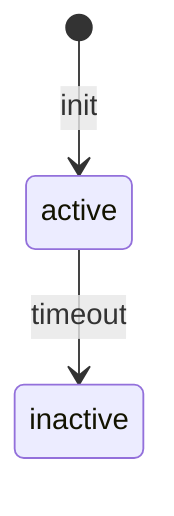

# Specs Publisher — Multi-Format Wiki Generator

Read markdown specs from `.specs/` (or user-specified directories) and publish them in the format of the user's choice. Detects which spec-driven tools generated the files and adapts accordingly.

## Hard Rules (Never Violate)

1. **NEVER render ANY flow, architecture, sequence, state machine, relationship, or process visually using ASCII characters.** Banned patterns include (but are not limited to): `-->`, `──►`, `│`, `├─►`, `└─►`, `▼`, `▲`, `|--|`, `+--`, `►`, `─`, `│`, `┐`, `└`, `┘`, `┌`, `├`, `┤`, `┬`, `┴`, `┼`, `║`, `═`, `╔`, `╗`, `╚`, `╝`, `╠`, `╣`, `╦`, `╩`, `╬`.

2. **Every visual representation MUST be a Mermaid code block:**
   ``````markdown
   ```mermaid
   flowchart TD
       A[Client] --> B[Core API]
       B --> C[External Vendor]
   ```
   ``````

3. **If you catch yourself typing ASCII arrows or boxes — STOP. Use Mermaid instead.**

4. **This applies to ALL output formats** — wiki, chat, markdown, code comments, everything.

5. **If the source markdown contains ASCII diagrams, rewrite them to Mermaid.**

## Trigger

When the user asks to build, generate, serve, or publish docs / wiki from spec markdown files. Also at session end when specs have accumulated without being published.

---

## Diagram Requirement — Always Use Mermaid

Any state flow, sequence, architecture, or process diagram in the output MUST use proper Mermaid syntax inside a fenced code block:

````markdown

````

**Do NOT** render diagrams as ASCII art (text characters like `-->`, `|`, `+--` drawn manually). ASCII diagrams are unreadable in wikis and cannot be edited. Mermaid renders natively in MkDocs Material (via `pymdownx.superfences`) and GitHub-flavored markdown.

When you encounter a diagram description in the source markdowns (e.g., "flow: X → Y → Z" or a text-based state diagram), convert it into proper Mermaid syntax.

Supported Mermaid diagram types for wikis:
- `flowchart` / `graph` — process flows, decision trees
- `sequenceDiagram` — request/response flows, API interactions
- `stateDiagram-v2` — state machines, lifecycle
- `classDiagram` — class structures, relationships
- `erDiagram` — entity-relationship models
- `gantt` — timelines, roadmaps
- `pie` — pie charts (rare, but valid)

---

## Step 1 — Onboarding Interview

Before touching any files, interview the user to build a clear specification of what they need. This eliminates ambiguity and ensures the output matches their real intent.

Use the `Question` tool for all choices. Free-form questions should be asked as text. Resolve ambiguities before moving on — if an answer is vague, drill in with follow-ups.

---

### 1a. Version check — is the skill up to date?

Before proceeding, check if the skill itself is outdated. The skill may be installed as a git clone (from GitHub) or as a direct copy.

```bash
# Check if this is a git repo
SKILL_DIR=$(dirname "$(find ~/.config/opencode/skills/md-to-wiki -name SKILL.md 2>/dev/null | head -1)")
if [ -z "$SKILL_DIR" ]; then
  SKILL_DIR=$(dirname "$(find .opencode/skills/wikis -name SKILL.md 2>/dev/null | head -1)")
fi
if [ -n "$SKILL_DIR" ] && [ -d "$SKILL_DIR/.git" ]; then
  cd "$SKILL_DIR"
  git fetch origin --quiet 2>/dev/null
  BEHIND=$(git rev-list --count HEAD..origin/main 2>/dev/null || echo 0)
  LOCAL=$(git rev-parse --short HEAD 2>/dev/null)
  REMOTE=$(git rev-parse --short origin/main 2>/dev/null)
  if [ "$BEHIND" -gt 0 ] 2>/dev/null; then
    echo "Skill is $BEHIND commit(s) behind. Local: $LOCAL | Remote: $REMOTE"
    OUTDATED=true
  else
    echo "Skill is up to date ($LOCAL)."
    OUTDATED=false
  fi
else
  OUTDATED=false
fi
```

If `OUTDATED=true`, ask the user:

> **This skill is $BEHIND commit(s) behind the latest version. Update now?**

- If yes: `cd "$SKILL_DIR" && git pull`, then inform the user: **"The skill has been updated. Please restart the agent/session for the changes to take effect."** Stop and wait for the user to restart before proceeding.
- If no: proceed with the current version

---

### 1b. Welcome and set context

Start with a brief summary of what the skill can do, then ask the opening question:

```
I can publish your spec markdowns into several formats:
  • Pure HTML site (GitHub docs style with search)
  • Swagger / OpenAPI (for API specs)
  • GitHub Wiki tab (push to repo.wiki.git)
  • DokuWiki (self-hosted wiki format)
  • PDF document (single book for review)

Let's start with a quick onboarding so I understand exactly what you need.
```

---

### 1c. Goals — what should the documentation achieve

Ask:

> **What are the main goals of this documentation? Who is it for?**

Probe for:
- **Audience**: Developers? Stakeholders? QA? New team members? External partners?
- **Purpose**: Reference? Onboarding? Compliance? API docs? Progress tracking?
- **Tone**: Technical deep-dive? Executive summary? Both?

If the answer is vague, drill in:

| Vague answer | Follow-up |
|-------------|-----------|
| "Document the project" | Who needs to read it? What decisions will they make from it? |
| "For the team" | Which part of the team — devs, PMs, QA, or all? |
| "API docs" | Who consumes the API — internal services, external partners, mobile apps? |
| "Everything" | That's broad. Let's prioritize — what's the top 3 things someone should find? |

Also ask if there are existing docs they want to replace or complement.

---

### 1d. Scope and context — what does the documentation cover

Ask:

> **What's the scope of this documentation? What should it cover and what should it exclude?**

Probe for:
- **Coverage**: All features? Specific features only? Current state only, or historical decisions too?
- **Depth**: Brief overviews? Full specs with all details? Both?
- **Boundaries**: Are there areas explicitly out of scope? (e.g., "Skip quick tasks", "Only include shipped features", "Exclude deprecated specs")

If the user says "everything" or is unsure, propose a sane default based on what you discover in the file scan:

> "I found these categories. Here's my recommendation for what to include based on a typical documentation site. Feel free to accept, add, or remove."

Keep the user focused — don't let scope creep. If they keep adding, ask:

> "I want to make sure we don't stretch too thin. Let me add this to a 'future expansion' list so we can deliver the current scope first. Is that OK?"

---

### 1e. Source selection — which markdown files to include

Ask:

> **Which markdown files should I use? I can either scan and pick the right ones based on the goals and scope you described, or you can point me to specific files and directories.**

Offer these options:

| Option | What happens |
|--------|-------------|
| **Agent picks** (recommended) | I scan `.specs/`, `docs/`, and related directories, then select files that match your stated goals and scope. |
| **Specify directories** | You tell me which folders to scan. |
| **Specify individual files** | You list exactly which .md files to include. |

#### If "Agent picks" — selection logic

Scan `.specs/`, `docs/`, and any adjacent markdown directories. Then apply rules based on the onboarding answers:

| Goal/Scope | Include | Exclude |
|------------|---------|---------|
| "API docs" | Files with endpoints, contracts, API specs, codebase/INTEGRATIONS.md | PROJECT.md, ROADMAP.md, quick tasks |
| "Onboarding for new devs" | PROJECT.md, codebase/*, feature specs (brief), CONVENTIONS.md | STATE.md (too detailed), quick tasks |
| "Stakeholder review" | PROJECT.md, ROADMAP.md, feature spec.md overviews | design.md, tasks.md (too technical) |
| "Full technical reference" | All | Nothing |
| "Compliance / audit trail" | Everything with dates, decisions, STATE.md | Quick tasks (unless relevant) |

Present your proposed file list to the user for confirmation:

```
Based on your goals, I propose including:
  ✅ .specs/project/PROJECT.md
  ✅ .specs/project/ROADMAP.md
  ✅ .specs/codebase/ARCHITECTURE.md
  ✅ .specs/features/auth/spec.md
  ❌ .specs/features/auth/tasks.md (filtered: stakeholder audience)
  ❌ .specs/quick/* (filtered: out of scope)

Does this look right?
```

#### If "Specify directories" — ask for paths, validate they exist, scan contents

```bash
ls -R <path>/**/*.md 2>/dev/null
```

Present the list and confirm.

#### If "Specify individual files" — ask for file paths one by one, validate each

Check each file exists. If not, ask for correction or suggest alternatives by scanning nearby.

---

### 1f. Ambiguity resolution checklist

Before moving on, verify:

- [ ] **Audience** is concrete (e.g., "backend devs new to the project", not just "devs")
- [ ] **Purpose** is concrete (e.g., "reduce onboarding time from 2 weeks to 3 days", not just "documentation")
- [ ] **Scope boundaries** are explicit (what's included AND what's excluded)
- [ ] **Files** are confirmed (user accepted or modified the proposed list)
- [ ] **Tone** is clear (technical, executive, mixed)

If any are still fuzzy, ask a targeted follow-up. Do NOT proceed until all checkboxes are green.

> **Ambiguity detection heuristics:**
> - If an answer is ≤3 words, it's probably vague — drill in
> - If the user says "you decide" or "whatever you think best", propose 2-3 concrete options with trade-offs
> - If the user contradicts themselves (e.g., "just API docs" then "include everything"), flag it explicitly: "I noticed you said API docs but also want everything — which takes priority?"

---

### 1g. Summarize back to the user

After the interview, present a concise summary:

```
## Documentation Plan

Audience:         Backend developers joining the project
Purpose:          Reduce onboarding time
Scope:            Project overview, architecture, all feature specs
Excluded:         Quick tasks, detailed implementation tasks
Source files:     12 files from .specs/ (auto-selected)
Format:           To be decided next
Tone:             Technical with one-paragraph executive summary per feature

Does this capture everything? Any changes?
```

Let the user amend before proceeding.

---

## Step 2 — Recommend format based on onboarding

Now use the onboarding answers to recommend the best format. Present the menu with a highlighted recommendation:

| # | Format | Best when |
|---|--------|-----------|
| 1 | **Pure HTML (MkDocs Material)** ← *recommended* | General purpose, multiple audiences, needs search and nav |
| 2 | **Swagger / OpenAPI** | Goals are API-focused, audience is developers integrating |
| 3 | **GitHub Tab Wiki** | Team already lives in GitHub, wants docs co-located with code |
| 4 | **DokuWiki** | Organization has a self-hosted DokuWiki that must be kept in sync |
| 5 | **PDF Document** | Stakeholder review, compliance, offline distribution, single-file deliverable |

Explain why you're recommending a specific format based on their answers. Let the user override.

---

## Step 3 — Execute the chosen format

Read the matching reference file **before** generating output. Do not improvise format steps from memory.

| # | Format | Read |
|---|--------|------|
| 1 | Pure HTML (MkDocs Material) | [formats-mkdocs.md](references/formats-mkdocs.md) |
| 2 | Swagger / OpenAPI | [formats-swagger.md](references/formats-swagger.md) |
| 3 | GitHub Tab Wiki | [formats-github-wiki.md](references/formats-github-wiki.md) |
| 4 | DokuWiki | [formats-dokuwiki.md](references/formats-dokuwiki.md) |
| 5 | PDF Document | [formats-pdf.md](references/formats-pdf.md) |

Follow the loaded reference completely; then continue with Steps 4–5.

## Step 4 — Offer deployment

After generating output, ask if they want to deploy:

| Format | Deployment |
|--------|-----------|
| Pure HTML | GitHub Pages (`mkdocs gh-deploy`), Netlify, Vercel, any static host |
| Swagger | Surge, GitHub Pages, or serve with Docker |
| GitHub Wiki | Already pushed to GitHub |
| DokuWiki | Directory ready for manual import to DokuWiki instance |
| PDF | Ready for email, download, or print |

## Step 5 — Cleanup (optional)

Offer to remove intermediate files. Ask before deleting anything.

## Multi-directory input and sharing

When the user needs multiple source directories or wants to share this skill, read [multi-directory-and-share.md](references/multi-directory-and-share.md).
