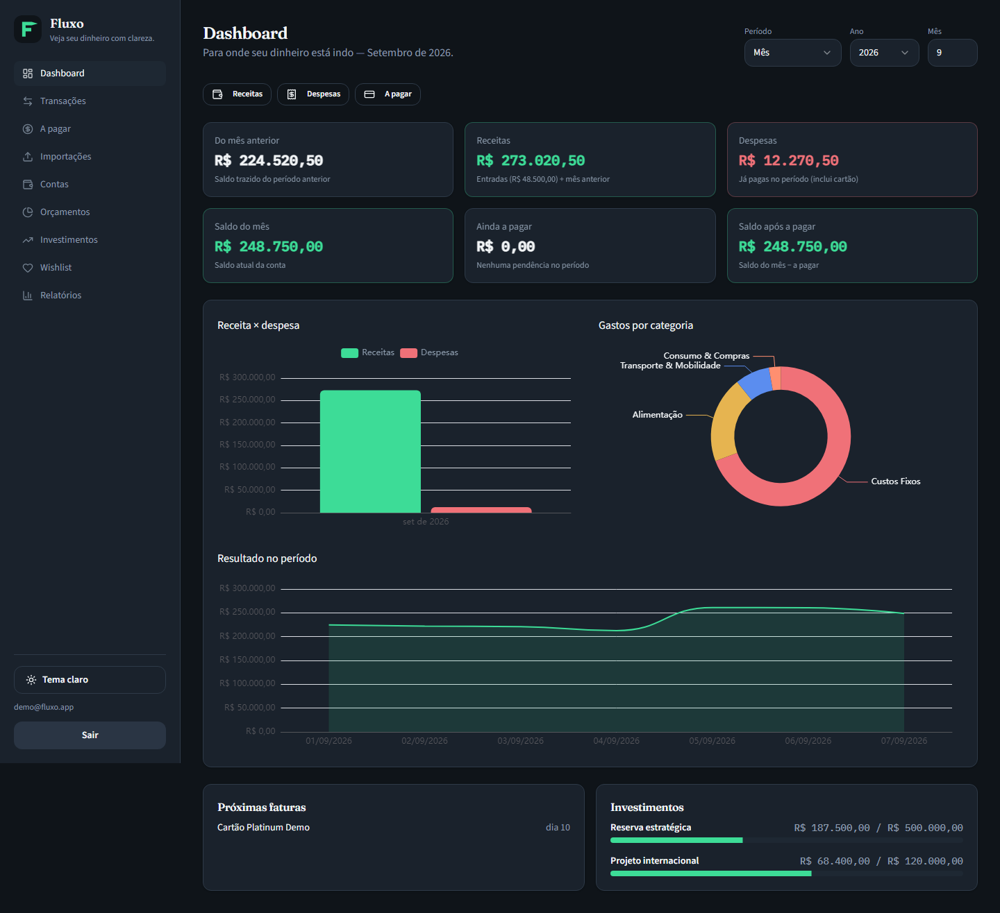
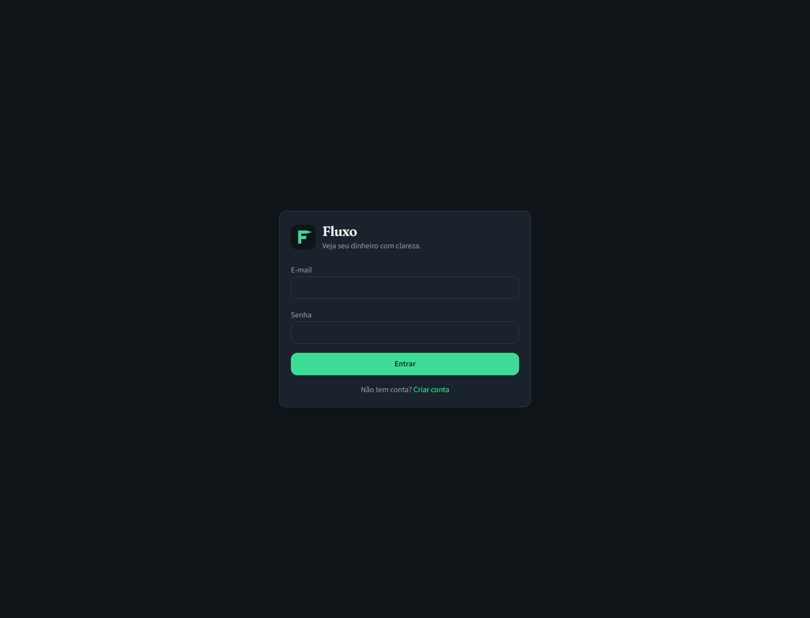
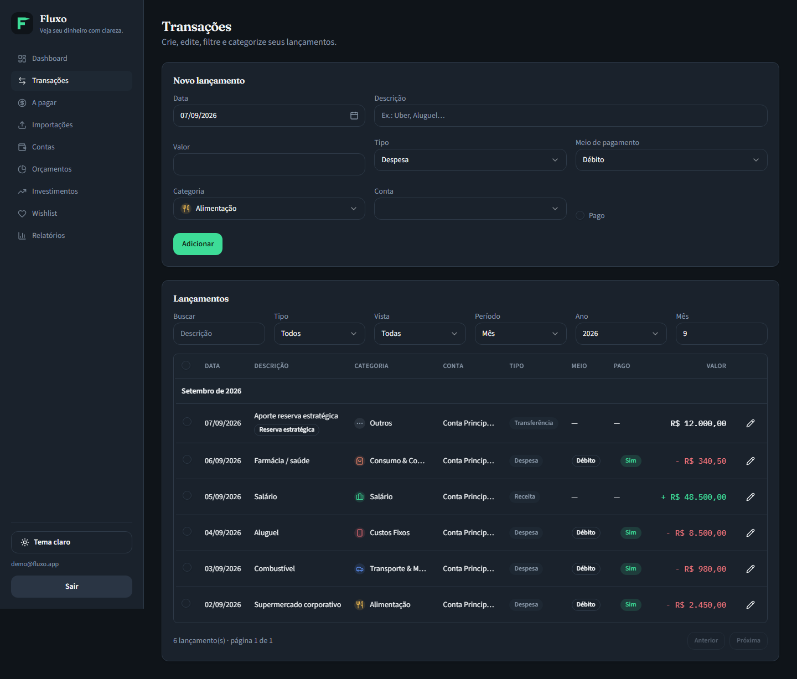
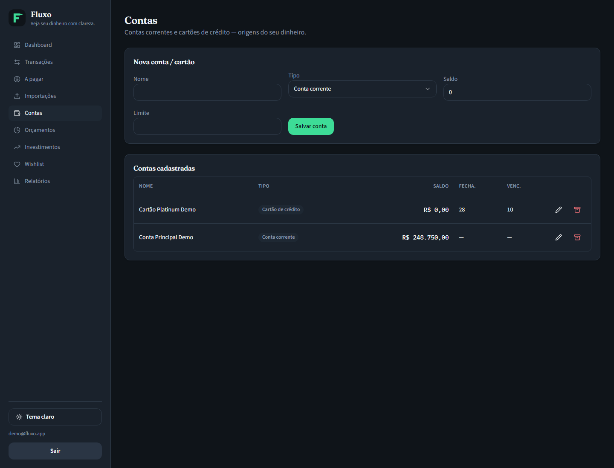
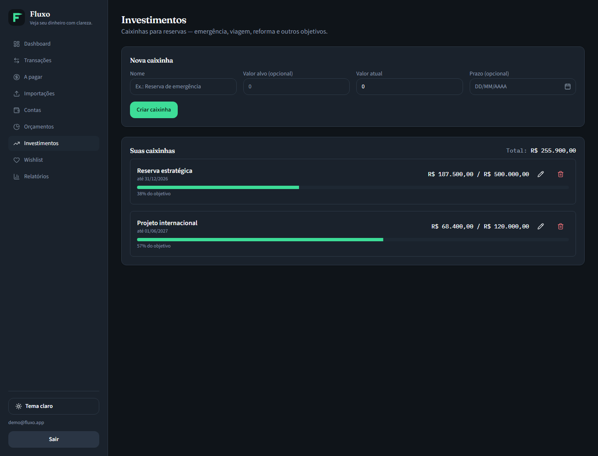

# Fluxo

<p align="center">
  <strong>Veja seu dinheiro com clareza.</strong><br/>
  Controle financeiro pessoal em BRL — sem planilha, sem Open Finance, com o extrato que você já tem.
</p>

<p align="center">
  <a href="https://fluxo-vieira.vercel.app/"></a>
  <a href="https://github.com/RafaelHDSV/Fluxo"></a>
  <a href="./LICENSE"></a>
  
  
</p>

<p align="center">
  <a href="https://fluxo-vieira.vercel.app/"><b>Abrir app</b></a>
  ·
  <a href="#preview">Preview</a>
  ·
  <a href="#setup">Setup</a>
  ·
  <a href="#contribuindo">Contribuir</a>
</p>

---

## 💡 O que é

Controle financeiro **individual**: contas, lançamentos, importação de extrato (OFX Santander + CSV), orçamentos, caixinhas, a pagar, dashboard e relatórios.

Autenticação Supabase, dados isolados por usuário (RLS), moeda **BRL**.

| | |
|:--|:--|
| 🚨 **Problema** | Planilha e apps genéricos não batem com o extrato do banco nem com a fatura do cartão. |
| 🎯 **Abordagem** | O **saldo da conta** é a âncora; OFX atualiza; cartão usa data de compra **e** vencimento. |
| 🚫 **Fora de escopo** | Open Finance (custo de agregador) — entrada principal = arquivo que você exporta. |

---

<a id="preview"></a>

## 🖼️ Preview

> Dados **fictícios** (valores altos de propósito). Nada de conta bancária real.



<details>
<summary>Mais telas (login, transações, contas, investimentos)</summary>

<br/>

| Login | Transações |
|:-----:|:----------:|
|  |  |

| Contas | Investimentos |
|:------:|:-------------:|
|  |  |

</details>

---

## 🎯 Por que assim

- ⚓ **Saldo das contas** é a âncora (editável; OFX pode gravar `LEDGERBAL`)
- 📊 No dashboard (período atual), o **Saldo do mês** espelha essa âncora — não é “receitas − despesas”
- 📄 Entrada mensal principal: **OFX do Santander** (CSV/OFX genérico de apoio)
- 💳 No cartão, **compra** e **vencimento** são datas diferentes; períodos usam o vencimento
- 🚫 Open Finance fica de fora de propósito

---

## ✨ Funcionalidades

<table>
<tr>
<td width="50%" valign="top">

### 🏦 Contas e saldo
- Contas de débito e cartão de crédito
- Saldo âncora; OFX pode gravar `LEDGERBAL`
- Cartão: fechamento + vencimento da fatura

### 💳 Transações
- Receita, despesa, **transferência** e ajuste
- **Marcar pago** = só status (não move saldo de novo)
- Crédito: data da compra + vencimento
- Transferência ↔ **caixinha** (aporte/resgate)

</td>
<td width="50%" valign="top">

### 📥 Importações
- OFX Santander (Money 2000+) e CSV/OFX genérico
- Regras de renomeação e categorização
- Preview + stepper antes de gravar

### 🎯 Orçamentos, caixinhas e wishlist
- Limite por categoria com alerta perto do teto
- Caixinhas (CRUD) com progresso
- Wishlist com imagem opcional

</td>
</tr>
<tr>
<td width="50%" valign="top">

### 📊 A pagar, dashboard e relatórios
- Pendências do período
- KPIs e gráficos (ECharts)
- **Saldo do mês** (atual) = âncora da conta

</td>
<td width="50%" valign="top">

### 📱 Experiência
- Tema claro / escuro
- Sidebar no desktop
- Nav inferior + “Mais” no mobile (safe-area)

</td>
</tr>
</table>

---

## 🔧 Stack

| Camada | Tecnologia |
|--------|------------|
| 🎨 Frontend | React 18 · Vite · TypeScript · Tailwind · shadcn/ui · React Router · ECharts · Lucide |
| ⚙️ Backend | Node.js · Express 5 (BFF → Serverless `/api` na Vercel) |
| 🔒 Auth / DB | Supabase — PostgreSQL · Auth (e-mail/senha) · RLS |
| 🛠️ Tooling | Yarn na raiz · Node **22+** |

Tabelas `fluxo_*`. Front → BFF (JWT) → Postgres.

```
frontend/          # Vite + React
backend/           # Express BFF + migrations
  migrations/      # SQL 001 → 010
  src/modules/     # rotas por domínio
.github/           # templates de issue/PR
```

`docs/` e `backend/scripts/` são locais — **não** vão no repositório público.

---

<a id="setup"></a>

## ⚡ Setup

### ✅ Pré-requisitos

- Node.js **22+**
- Yarn
- Projeto no [Supabase](https://supabase.com)

### 🗄️ 1. Banco

No SQL Editor do Supabase, aplique `backend/migrations/` **na ordem** (`001` → `010`).

### 🔑 2. Variáveis de ambiente

```bash
cp frontend/.env.example frontend/.env
cp backend/.env.example backend/.env
```

| Variável | Onde | Uso |
|----------|------|-----|
| `VITE_SUPABASE_URL` | frontend | URL do projeto |
| `VITE_SUPABASE_ANON_KEY` | frontend | Chave anônima (cliente) |
| `VITE_BACKEND_URL` | frontend | Local: `http://localhost:3693`. Produção: **vazio** (same-origin) |
| `DATABASE_URL` | backend | Connection string Postgres |
| `SUPABASE_URL` | backend | Auth / JWKS |
| `SUPABASE_ANON_KEY` | backend | Runtime |
| `SUPABASE_JWT_SECRET` | backend | Recomendado (Dashboard → API → JWT Secret) |
| `CORS_ORIGIN` | backend | Local: `http://localhost:3333` |
| `PORT` | backend | Local: `3693` |

Nunca commite `.env` com valores reais — só `.env.example`.

### 🚀 3. Subir localmente

```bash
yarn
yarn dev
```

| Serviço | URL |
|---------|-----|
| Frontend | http://localhost:3333 |
| API (BFF) | http://localhost:3693 |

Crie a conta no registro, cadastre as contas (saldo) e, se quiser, importe o OFX.

### 🧪 Scripts úteis

```bash
cd backend && yarn test     # parsers OFX/CSV e ciclo de crédito
cd frontend && yarn lint
cd frontend && yarn build
cd backend && yarn build
```

---

## ☁️ Deploy (Vercel)

Um projeto serve o **SPA** e o **BFF** em `/api/*`.

1. Importe o repositório (Root Directory = raiz do monorepo).
2. Configure as variáveis:

| Variável | Obrigatória | Notas |
|----------|-------------|--------|
| `VITE_SUPABASE_URL` | sim | Build do front |
| `VITE_SUPABASE_ANON_KEY` | sim | Build do front |
| `VITE_BACKEND_URL` | não | **Vazio** em produção |
| `DATABASE_URL` | sim | Runtime |
| `SUPABASE_URL` | sim | Runtime |
| `SUPABASE_ANON_KEY` | sim | Runtime |
| `SUPABASE_JWT_SECRET` | recomendado | Validação JWT |
| `CORS_ORIGIN` | opcional | Local usa `http://localhost:3333` |

3. Publique. Em produção o front chama `/api/...` no mesmo domínio.

---

## 📝 Decisões de produto

| Tema | Decisão |
|------|--------|
| Moeda | BRL apenas |
| Open Finance | Fora de escopo |
| Saldo | Âncora = `fluxo_accounts.balance`; período atual no dashboard usa essa âncora |
| Pago | Toggle de despesa = status; não reaplica delta de caixa |
| Crédito | Entra em despesas/orçamentos pela data efetiva; não move corrente até pagar a fatura |
| Caixinhas | Aporte/resgate via transferência + `goal_id` / `goal_direction` |

Mudanças nessas regras: discuta na issue antes de implementar.

---

<a id="contribuindo"></a>

## 🤝 Contribuindo

1. Descreva problema e solução no PR
2. Rode lint, testes e build
3. Sem secrets no diff

[CONTRIBUTING.md](./CONTRIBUTING.md) · [Código de Conduta](./CODE_OF_CONDUCT.md) · vulnerabilidades: [SECURITY.md](./SECURITY.md)

---

## 📄 Licença

MIT © 2026 [Rafael Vieira](https://github.com/RafaelHDSV) — [LICENSE](./LICENSE).

---

## ☕ Apoie o projeto

Se o Fluxo te ajudou a organizar as finanças ou serviu de base para outro trabalho, um café faz diferença.

<a href="https://www.buymeacoffee.com/vieira" target="_blank" rel="noopener noreferrer">
  
</a>
